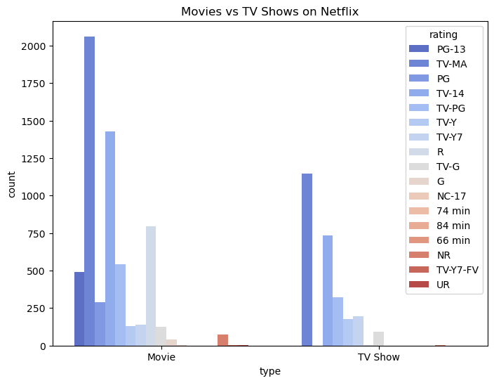
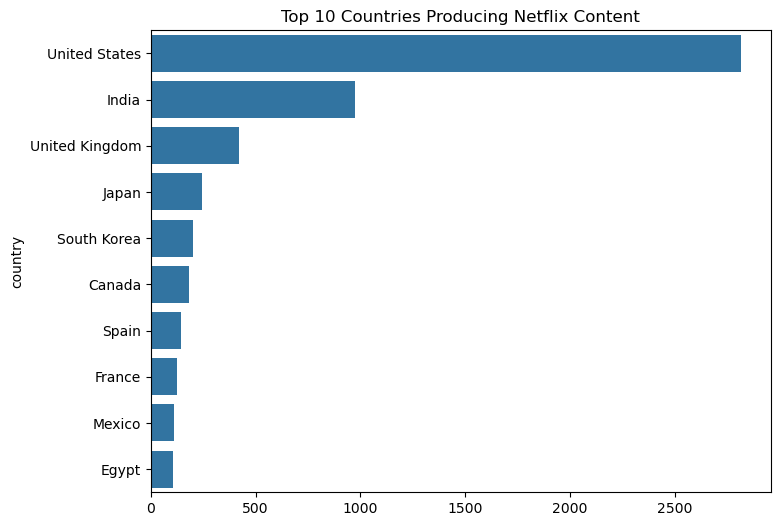
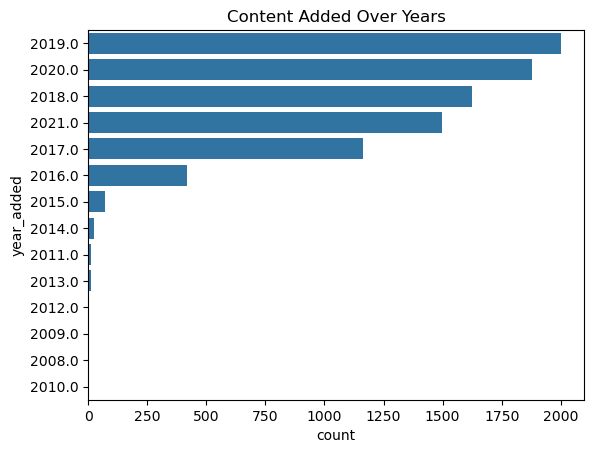
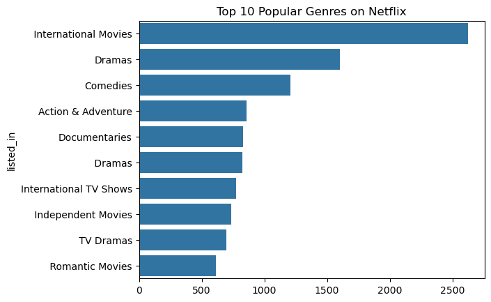
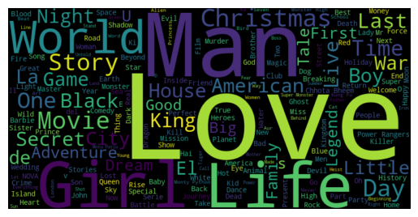

# 🎬 Netflix Data Analysis & Recommendation System

## 📌 Overview
This project analyzes Netflix’s dataset to uncover insights about movies and TV shows, including trends in content production, popular genres, and content distribution over the years.  
Additionally, it includes a simple content **recommendation system** based on description similarity.

---

## 🔧 Tech Stack
- **Python:** Pandas, NumPy  
- **Visualization:** Matplotlib, Seaborn, WordCloud  
- **Machine Learning:** scikit-learn (TF-IDF, Cosine Similarity)  
- **Environment:** Jupyter Notebook  

---

## 📊 Key Insights

### 1️⃣ Movies vs TV Shows
  
- Movies are more common than TV shows on Netflix.

### 2️⃣ Top 10 Content-Producing Countries
  
- USA produces the highest number of titles.

### 3️⃣ Content Added Over the Years
  
- Netflix content has steadily increased over the years.

### 4️⃣ Top 10 Genres
  
- Drama and Comedy are the most frequent genres.

### 5️⃣ Word Cloud of Titles
  
- Visualizes the most common words in Netflix titles.

---

## 🤖 Recommendation System
- **Method:** TF-IDF vectorization + Cosine Similarity  
- **Functionality:** Given a title, recommends 5 similar shows/movies based on description.  
- **Example Usage:**
```python
recommend('Narcos')
